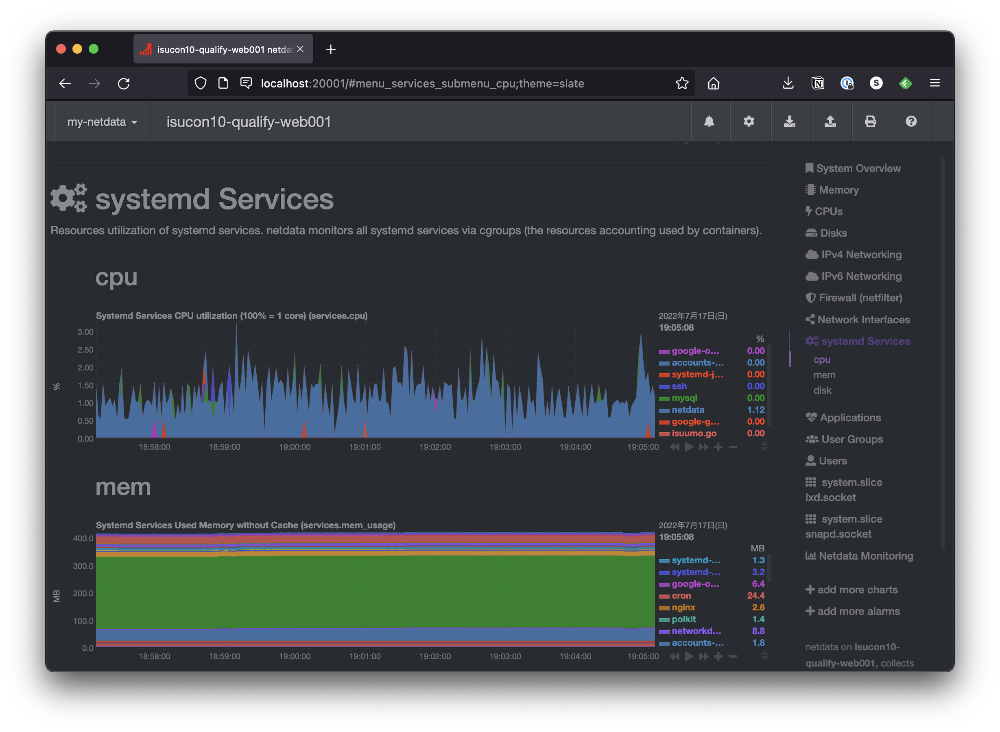
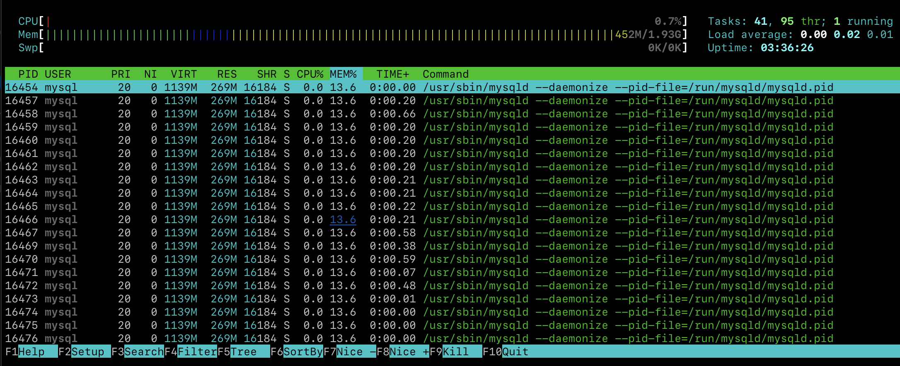
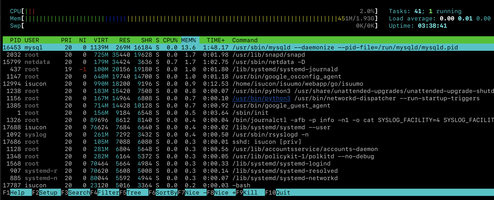

# Monitoring

## Netdata

各ホストの Port 19999 でリッスンしている。ローカルからSSHでポートフォワードしてアクセスする。

```
ssh -NL 19999:localhost:19999 isu1
```

これでlocalhostの19999と、リモートの19999が接続される。ブラウザで http://localhost:19999/ にアクセスすると表示できる。

複数のホストに接続する場合、ポート番号が被ってしまうので以下のコマンドを使うことにする。

```
ssh -NL 20001:localhost:19999 isu1
ssh -NL 20002:localhost:19999 isu2
ssh -NL 20003:localhost:19999 isu3
```

リンク
- http://localhost:20001/
- http://localhost:20002/
- http://localhost:20003/

このコマンドはフォアグラウンドで占有し続けてプロンプトを返さない。終了したい場合は `Ctrl + C` を使う。

上記コマンドで接続時、以下の様なWARNINGが出た場合ポートフォワードは無効にされており接続出来ない。

```
@@@@@@@@@@@@@@@@@@@@@@@@@@@@@@@@@@@@@@@@@@@@@@@@@@@@@@@@@@@
@    WARNING: REMOTE HOST IDENTIFICATION HAS CHANGED!     @
@@@@@@@@@@@@@@@@@@@@@@@@@@@@@@@@@@@@@@@@@@@@@@@@@@@@@@@@@@@
IT IS POSSIBLE THAT SOMEONE IS DOING SOMETHING NASTY!
Someone could be eavesdropping on you right now (man-in-the-middle attack)!
It is also possible that a host key has just been changed.
The fingerprint for the ED25519 key sent by the remote host is
SHA256:XXXXXXXXXXXXXXXXXXXXXXXXXXXXXXXXXXXXXXXXXXXXX.
Please contact your system administrator.
Add correct host key in /Users/pddg/.ssh/known_hosts to get rid of this message.
Offending ECDSA key in /Users/pddg/.ssh/known_hosts:23
Password authentication is disabled to avoid man-in-the-middle attacks.
Keyboard-interactive authentication is disabled to avoid man-in-the-middle attacks.
UpdateHostkeys is disabled because the host key is not trusted.
Welcome to Ubuntu 18.04.6 LTS (GNU/Linux 5.4.0-1083-gcp x86_64)
```

この場合は対象のホストのIPアドレスを調べて以下のコマンドを実行する。

```
IP_ADDR=
ssh-keygen -R "${IP_ADDR}"
```

### NOTE

Netdataでは、一定以上の負荷がかかるまで一覧に出てこないことがある。

### Systemdサービスの状態を確認する

基本的にはこの画面を見れば良い。
右カラムから `systemd services` を選択する。



## htop

```
htop
```

topの高機能版みたいなやつ。マウス操作に対応しているので、カラムをクリックするとその項目で並び替えることが出来る（同じカラムをクリックして昇順降順切り替え）。

### 同じ名前のスレッドが大量に表示される

以下の画像の様に、同じ名前のスレッドが大量に表示されるケースがある。デフォルトではユーザランドのスレッドを全て表示するため。



`Shift + H` で表示非表示を切り替えられる。




